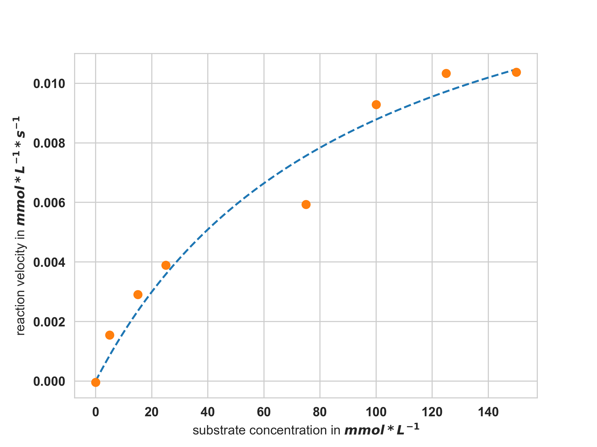

# Characterisation of the SLAC

This experiment describes the characterisation of the small laccase from _Streptomyces coelicolor_. In this experiment, the activity of the enzyme was investigated by the oxidation of ABTS (2,2′-Azino-bis(3-ethylbenzothiazoline-6-sulfonic acid) diammonium salt).
An in detail description of the experiments can be found in the folder _A540 nm_ where the data is collected in EnzymeML documents.

